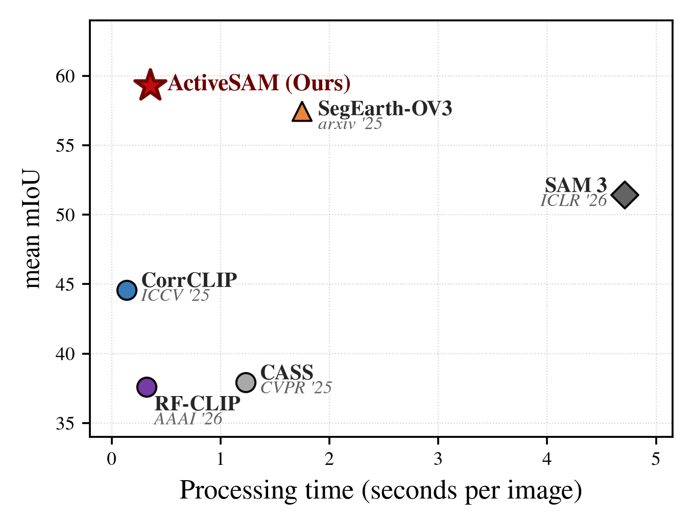
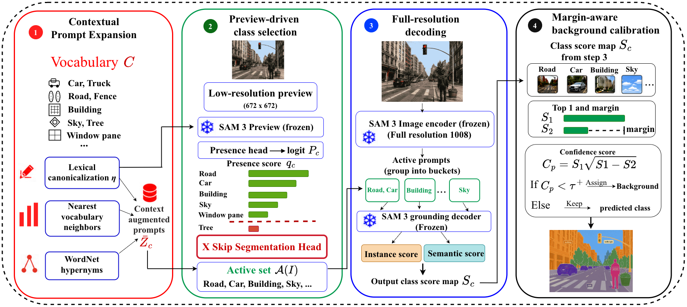
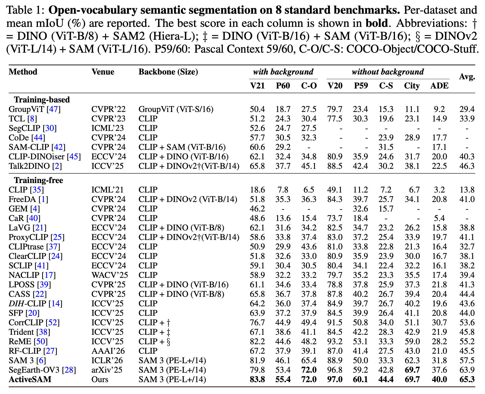
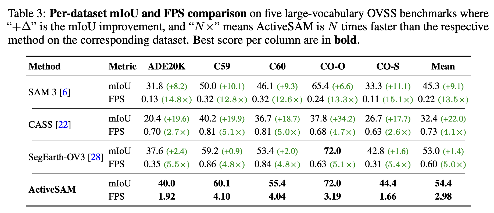
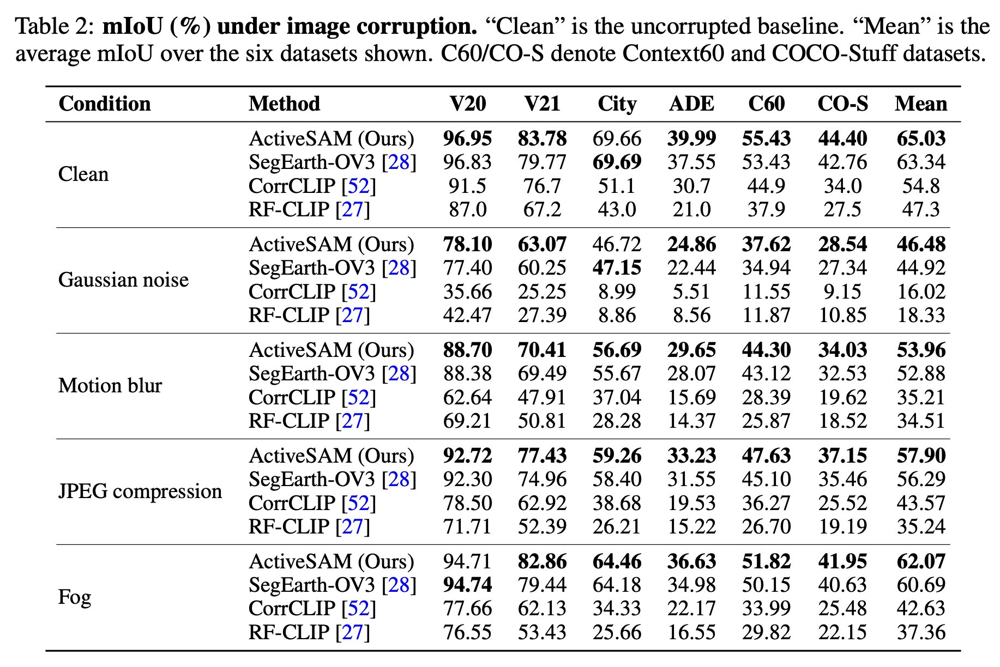

<h1 align="center">ActiveSAM: Image-Conditional Class Pruning for Fast and Accurate Open-Vocabulary Segmentation</h1>

<p align="center">
  <b>Official implementation of our paper</b>
  <a href="https://arxiv.org/abs/2606.16996">
    
  </a>
</p>

<p align="center">
  <a href="https://scholar.google.com/citations?user=NTeODecAAAAJ&amp;hl=vi">Tran Dinh Tien</a>
  &nbsp;&middot;&nbsp;
  <a href="https://zhiqiangshen.com/">Zhiqiang Shen</a>
</p>

<p align="center">VILA Lab, MBZUAI</p>

<p align="center">
  
</p>

## Abstract

Segment Anything Model 3 (SAM 3) provides a strong frozen backbone for concept-prompted segmentation, but applying it directly to open-vocabulary semantic segmentation (OVSS) is inefficient: full-resolution decoding is typically run over the entire dataset vocabulary, whereas each image contains only a small active subset of classes. We introduce **ActiveSAM**, **a training-free, zero-shot inference framework** that turns SAM 3 into an active-vocabulary segmenter. ActiveSAM first canonicalizes and expands class prompts, then estimates an image-conditioned active set from a Low-resolution Presence Preview. Only the retained classes are decoded at full resolution, using bucketed prompt multiplexing with the frozen SAM 3 decoder. The preview stage uses only class-presence evidence and skips unnecessary segmentation-head computation, while the final stage applies Margin-aware Background Calibration to suppress low-confidence pixels. ActiveSAM requires no target-dataset training, no weight updates, and no oracle class-presence labels. Across 8 OVSS benchmarks, ActiveSAM improves the speed-accuracy tradeoff of training-free open-vocabulary semantic segmentation, **outperforming** current state-of-the-art SegEarth-OV3 by approximately **+1.4 mIoU** on average while running up to **5.5× faster** on large-vocabulary datasets. ActiveSAM also demonstrates the strongest robustness under image corruption that simulates real-world distribution shift, making it well-suited for deployment in noisy-input domains such as autonomous driving and embodied AI.

## Method Overview

<p align="center">
  
</p>

ActiveSAM adapts frozen SAM 3 to activate only image-relevant class prompts. (1) **Contextual Prompt Expansion** first canonicalizes raw classes and expands each class prompt with lexical and vocabulary-level context. (2) **Preview-driven class selection** runs a low-resolution presence preview and forms an image-conditioned active class set `A(I)`; because this stage only estimates class presence, *segmentation-head decoding is skipped* for faster inference. (3) **Full-resolution decoding** encodes the image once and decodes only prompts in `A(I)`, grouped into buckets for prompt multiplexing. Instance and semantic scores are fused by pixelwise maximization to obtain class score maps. (4) **Margin-aware background calibration** assigns background to pixels whose calibrated confidence `c(p) = s₁(p)·√(s₁(p) − s₂(p))`, computed from the top two class scores `s₁(p)` and `s₂(p)`, falls below threshold `τ⁺`.

## Setup

we use [micromamba](https://mamba.readthedocs.io) for setup and install the dependencies. (The reference environment is **Python 3.12 with CUDA 12.8** running on single NVIDIA RTX 5090).

```bash
micromamba create -y -n activesam python=3.12
micromamba activate activesam
pip install -U pip setuptools wheel

# Install PyTorch (CUDA 12.8) first — mmcv is compiled against it.
pip install torch==2.8.0+cu128 torchvision==0.23.0+cu128 \
    --extra-index-url https://download.pytorch.org/whl/cu128

# Remaining pinned dependencies. mmcv 2.1.0 builds from source against the
# already-installed torch, so pass --no-build-isolation (this needs gcc/g++ and
# the CUDA 12.8 nvcc on PATH).
pip install -r requirements.txt --no-build-isolation

python -c "import nltk; nltk.download('wordnet')" 
```

Then point `data/<Name>` at the dataset roots referenced by the per-dataset
configs' `data_root`.

## Download checkpoints of SAM 3

Download the SAM 3 checkpoint from [HF](https://huggingface.co/facebook/sam3) and place it at `weights/sam3/sam3.pt`.

## Dataset Preparation

ActiveSAM is evaluated on eight standard open-vocabulary segmentation benchmarks. Please prepare them by following the standard
[mmsegmentation](https://github.com/open-mmlab/mmsegmentation/blob/main/docs/en/user_guides/2_dataset_prepare.md) dataset preparation.

Then link each prepared dataset into `data/` under the name the configs expect (the
per-dataset `data_root`):

| Benchmark(s) | `data/` path | Prepared dataset |
|---|---|---|
| VOC21, VOC20 | `data/VOC2012` | `VOCdevkit/VOC2012` (Pascal VOC 2012) |
| Context59, Context60 | `data/VOC2010` | `VOCdevkit/VOC2010` (Pascal Context) |
| COCO-Object | `data/COCOObject` | `coco_object` |
| COCO-Stuff | `data/COCOStuff` | `coco_stuff164k` |
| Cityscapes | `data/CityScapes` | `cityscapes` |
| ADE20K | `data/ADE20K` | `ADEChallengeData2016` |

For example, with the datasets prepared elsewhere on disk:

```bash
ln -s /path/to/VOCdevkit/VOC2012      data/VOC2012
ln -s /path/to/VOCdevkit/VOC2010      data/VOC2010
ln -s /path/to/coco_object            data/COCOObject
ln -s /path/to/coco_stuff164k         data/COCOStuff
ln -s /path/to/cityscapes             data/CityScapes
ln -s /path/to/ADEChallengeData2016   data/ADE20K
```


VOC, Cityscapes, COCO-Stuff and ADE20K are used directly after the standard
mmsegmentation preparation above. Pascal Context (59/60) and COCO-Object need one extra
label-conversion step so the masks carry the evaluated class IDs — Pascal Context with
mmsegmentation's Pascal Context converter (producing the `SegmentationClassContext`
masks), and COCO-Object with the open-vocabulary COCO-Object conversion (80 objects +
background, producing `annotations/*_instanceTrainIds.png`). For convenience, ActiveSAM
ships the matching dataset classes in `activesam/datasets.py`, so once the data is
converted it loads as-is.

## Evaluation

```bash
bash run_eval.sh                                      # all eight benchmarks
bash run_eval.sh --datasets voc21 cityscapes ade20k   # a chosen subset
python eval.py configs/cfg_voc21.py --n-images 20     # quick smoke test (a few images)
```

Each run prints mIoU / aAcc / FPS and writes `work_dirs/<cfg>/results.json`.

## Results

<p align="center">
  
</p>


## Speed vs accuracy

<p align="center">
  
</p>

## Robustness to corruptions

```bash
bash run_corruption.sh                                 # all six robustness benchmarks
bash run_corruption.sh --datasets voc21 cityscapes     # a chosen subset
```

<p align="center">
  
</p>


## Acknowledgements

We sincerely thank the [SAM 3](https://github.com/facebookresearch/sam3) authors for releasing their model and code. We also thank the authors of [SegEarth-OV3](https://github.com/earth-insights/SegEarth-OV-3) for their open-source code, which served as a reference for our benchmark comparison and dual-head fusion implementation.
