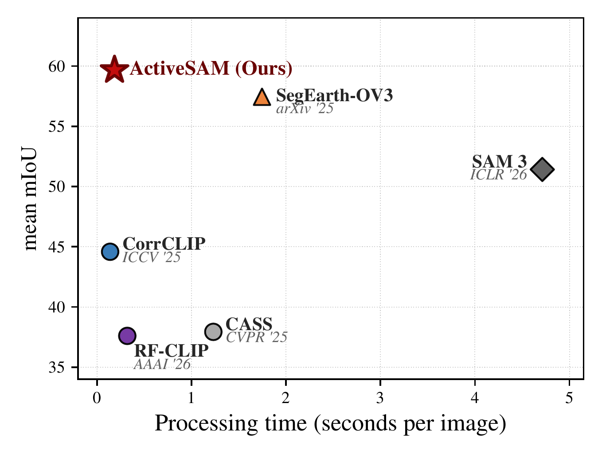
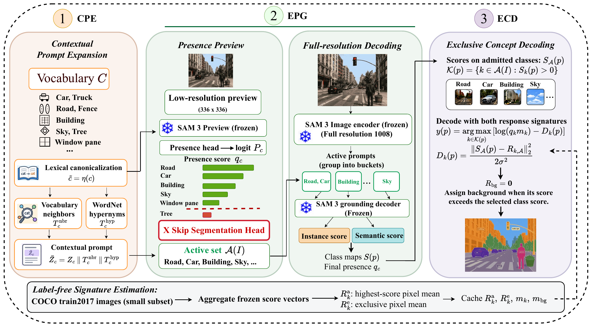
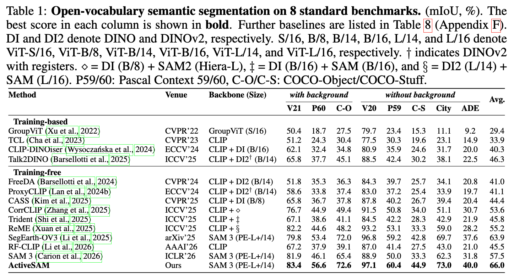
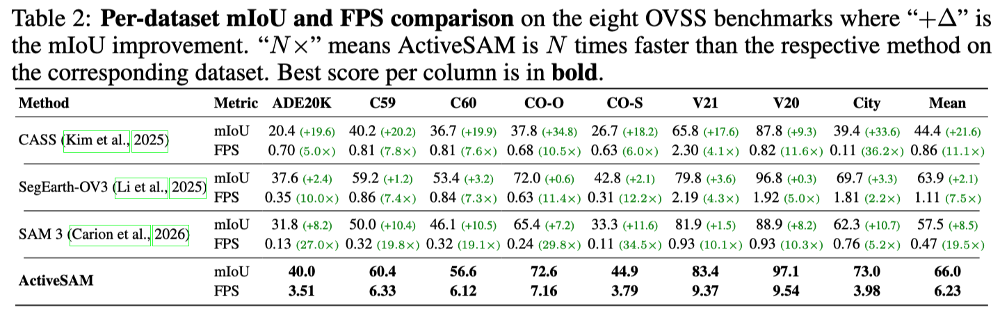
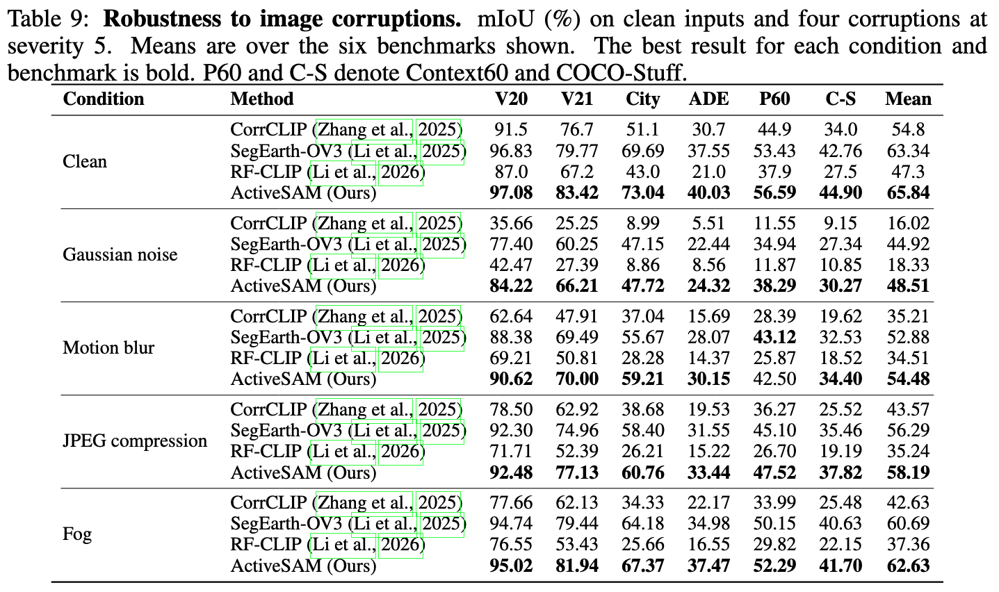

<h1 align="center">ActiveSAM: Fast and Accurate Open-Vocabulary Semantic Segmentation with Frozen SAM 3</h1>

<p align="center">
  <b>Official implementation of our paper</b>
  <a href="https://arxiv.org/abs/2606.16996">
    
  </a>
</p>

<p align="center">
  <a href="https://scholar.google.com/citations?user=NTeODecAAAAJ&amp;hl=vi">Tran Dinh Tien</a>
  &nbsp;&middot;&nbsp;
  <a href="https://zhiqiangshen.com/">Zhiqiang Shen</a>
</p>

<p align="center">VILA Lab, MBZUAI</p>

<p align="center">
  
</p>

## Abstract

Segment Anything Model 3 (SAM 3) provides a strong frozen backbone for concept-prompted segmentation, but applying it directly to open-vocabulary semantic segmentation (OVSS) is inefficient: full-resolution decoding is typically run over the entire dataset vocabulary, whereas each image contains only a small active subset of classes. We introduce **ActiveSAM**, **a training-free, zero-shot inference framework** that turns SAM 3 into an active-vocabulary segmenter. ActiveSAM first canonicalizes and expands class prompts, then uses **Evidence-Proportional Grounding** to estimate an image-conditioned active set from a low-resolution presence preview. Only retained prompts receive full-resolution mask prediction, using bucketed prompt multiplexing with the frozen SAM 3 decoder. The preview stage uses only class-presence evidence and skips unnecessary segmentation-head computation. To resolve overlapping concept responses, **Exclusive Concept Decoding** compares each pixel's joint score vector with class signatures estimated once per vocabulary from unlabeled images. ActiveSAM requires no weight updates, no oracle class-presence labels and no per-dataset hyperparameter tuning. Across 8 OVSS benchmarks, ActiveSAM improves the speed-accuracy tradeoff of training-free open-vocabulary semantic segmentation, **outperforming** current state-of-the-art SegEarth-OV3 by **+2.1 mIoU** on average while running much faster, with **7.3–12.2× speedups** on large-vocabulary datasets. ActiveSAM also achieves the highest accuracy under image corruptions that simulate real-world distribution shift, making it well-suited for deployment in noisy-input domains such as autonomous driving and embodied AI.

## Method Overview

<p align="center">
  
</p>

ActiveSAM decodes only the prompts relevant to each image and resolves overlapping concept responses, with all SAM 3 weights frozen. (1) **Contextual Prompt Expansion (CPE)** canonicalizes class names and expands their prompts. (2) A low-resolution **presence preview** skips the segmentation head and admits only the classes likely to be present. (3) **Full-resolution decoding** encodes the image once and decodes the active prompts in buckets. Steps (2) and (3) form **Evidence-Proportional Grounding (EPG)**. (4) **Exclusive Concept Decoding (ECD)** labels each pixel by comparing its score vector with class signatures estimated once per vocabulary from unlabeled images.

## Setup

we use [micromamba](https://mamba.readthedocs.io) for setup and install the dependencies. (The reference environment is **Python 3.12 with CUDA 12.8** running on single NVIDIA RTX 5090).

```bash
micromamba create -y -n activesam python=3.12
micromamba activate activesam
pip install -U pip setuptools wheel

# Install PyTorch (CUDA 12.8) first — mmcv is compiled against it.
pip install torch==2.8.0+cu128 torchvision==0.23.0+cu128 \
    --extra-index-url https://download.pytorch.org/whl/cu128

# Remaining pinned dependencies. mmcv 2.1.0 builds from source against the
# already-installed torch, so pass --no-build-isolation (this needs gcc/g++ and
# the CUDA 12.8 nvcc on PATH).
pip install -r requirements.txt --no-build-isolation

python -c "import nltk; nltk.download('wordnet')" 
```

Then point `data/<Name>` at the dataset roots referenced by the per-dataset
configs' `data_root`.

## Download checkpoints of SAM 3

Download the SAM 3 checkpoint from [HF](https://huggingface.co/facebook/sam3) and place it at `weights/sam3/sam3.pt`.

## Dataset Preparation

ActiveSAM is evaluated on eight standard open-vocabulary segmentation benchmarks. Please prepare them by following the standard
[mmsegmentation](https://github.com/open-mmlab/mmsegmentation/blob/main/docs/en/user_guides/2_dataset_prepare.md) dataset preparation.

Then link each prepared dataset into `data/` under the name the configs expect (the
per-dataset `data_root`):

| Benchmark(s) | `data/` path | Prepared dataset |
|---|---|---|
| VOC21, VOC20 | `data/VOC2012` | `VOCdevkit/VOC2012` (Pascal VOC 2012) |
| Context59, Context60 | `data/VOC2010` | `VOCdevkit/VOC2010` (Pascal Context) |
| COCO-Object | `data/COCOObject` | `coco_object` |
| COCO-Stuff | `data/COCOStuff` | `coco_stuff164k` |
| Cityscapes | `data/CityScapes` | `cityscapes` |
| ADE20K | `data/ADE20K` | `ADEChallengeData2016` |

For example, with the datasets prepared elsewhere on disk:

```bash
ln -s /path/to/VOCdevkit/VOC2012      data/VOC2012
ln -s /path/to/VOCdevkit/VOC2010      data/VOC2010
ln -s /path/to/coco_object            data/COCOObject
ln -s /path/to/coco_stuff164k         data/COCOStuff
ln -s /path/to/cityscapes             data/CityScapes
ln -s /path/to/ADEChallengeData2016   data/ADE20K
```


VOC, Cityscapes, COCO-Stuff and ADE20K are used directly after the standard
mmsegmentation preparation above. Pascal Context (59/60) and COCO-Object need one extra
label-conversion step so the masks carry the evaluated class IDs — Pascal Context with
mmsegmentation's Pascal Context converter (producing the `SegmentationClassContext`
masks), and COCO-Object with the open-vocabulary COCO-Object conversion (80 objects +
background, producing `annotations/*_instanceTrainIds.png`). For convenience, ActiveSAM
ships the matching dataset classes in `activesam/datasets.py`, so once the data is
converted it loads as-is.

## Evaluation

```bash
bash run_eval.sh                                      # all eight benchmarks
bash run_eval.sh voc21 city_scapes ade20k             # a chosen subset
python eval.py configs/cfg_voc21.py --n-images 20     # quick smoke test (a few images)
```

Each run prints mIoU / aAcc / FPS and writes `work_dirs/<cfg>/results.json`.

## Label-free signature estimation

The class signatures used by Exclusive Concept Decoding are shipped in `signatures/`. They are estimated once per
vocabulary from the same subset of unlabeled COCO train2017 images, with no label and no evaluation image. The script
is provided in case you want to build them again yourself:

```bash
python calibrate.py configs/cfg_voc21.py --out signatures/voc21.npz
```

## Results

<p align="center">
  
</p>


## Speed vs accuracy

<p align="center">
  
</p>

## Robustness to corruptions

```bash
bash run_corruption.sh                                 # all six robustness benchmarks
bash run_corruption.sh voc21 city_scapes               # a chosen subset
```

<p align="center">
  
</p>


## Citation

If you find ActiveSAM useful in your research, please cite our paper:

```bibtex
@article{tien2026activesam,
  title   = {{ActiveSAM}: Fast and Accurate Open-Vocabulary Semantic Segmentation with Frozen {SAM} 3},
  author  = {Tien, Tran Dinh and Shen, Zhiqiang},
  journal = {arXiv preprint arXiv:2606.16996},
  year    = {2026}
}
```

## Acknowledgements

We sincerely thank the [SAM 3](https://github.com/facebookresearch/sam3) authors for releasing their model and code. We also thank the authors of [SegEarth-OV3](https://github.com/earth-insights/SegEarth-OV-3) for their open-source code, which served as a reference for our benchmark comparison and dual-head fusion implementation.
